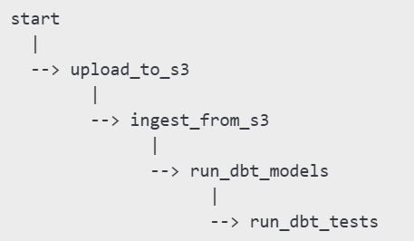

# youtube-2025-data-pipeline

A modular, and scalable end-to-end Data Engineering project that ingests video performance data from the YouTube 2025 Dataset, stores it in AWS S3 and PostgreSQL, transforms the data using dbt, orchestrates all steps with Apache Airflow, and provides dynamic visualizations with Metabase.

This project was structured following best practices of modern Data Engineering, enabling reproducibility, observability, modularity, and ease of future integration with cloud services.

## Objective

To build a professional-grade ETL pipeline that:

✅ Ingests raw CSV data into AWS S3 and PostgreSQL

✅ Transforms and models the data using dbt

✅ Automates the pipeline using Apache Airflow

✅ Visualizes YouTube analytics through Metabase dashboards

✅ Ensures a modular, testable, and well-documented architecture

## Tools & Technologies

| Stage          | Tool / Technology      | Purpose                                  |
| -------------- | ---------------------- | ---------------------------------------- |
| Ingestion      | Python, boto3          | Upload raw data to AWS S3                |
| Ingestion      | Python, psycopg2       | Load data from S3 to PostgreSQL          |
| Transformation | dbt (data build tool)  | SQL-based modeling and cleaning          |
| Orchestration  | Apache Airflow         | Task scheduling and ETL orchestration    |
| Infrastructure | Docker, Docker Compose | Containerization and environment control |
| Storage        | AWS S3, PostgreSQL     | Raw and processed data persistence       |
| Visualization  | Metabase               | Dashboards and data exploration          |
| Testing        | dbt tests, Pytest      | Data validation and ingestion testing    |
| Config         | dotenv (.env)          | Secure credential management             |

## Pipeline Architecture

### Ingestion:

- Raw YouTube dataset (CSV) is uploaded to AWS S3 using the upload_to_s3.py script

- ingest_from_s3_to_postgres.py reads the S3 file and loads it into a PostgreSQL table

### Transformation:

- dbt transforms the raw table into clean staging and mart models

Examples:

   - stg_youtube_data: cleans and normalizes column types

   - youtube_summary: aggregates insights such as total views, likes, duration, and engagement metrics

### Orchestration: 

The DAG below orchestrates the full flow:

- Metabase reads from PostgreSQL

- KPIs and metrics visualized as:

   - Top Categories

   - Views by Country

   - Engagement Analysis

   - Views per Subscriber

## Dashboard 