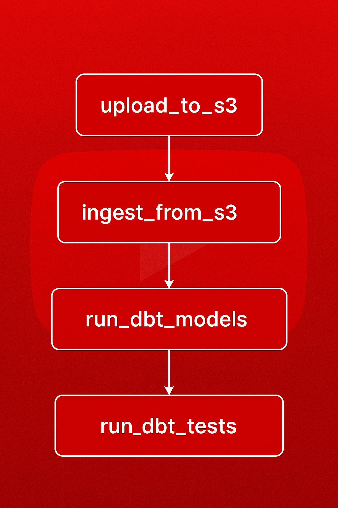

# YouTube 2025 Data Pipeline

A modular and scalable Data Engineering project designed to ingest YouTube channel performance data, store it securely in AWS S3 and PostgreSQL, transform it through dbt, orchestrate workflows using Apache Airflow, and deliver dynamic visualizations with Metabase.

Structured according to modern Data Engineering best practices, this project ensures reproducibility, observability, modularity, and seamless integration with cloud services, providing a robust and extensible foundation for data-driven analytics.

## Problem Statement

This project addresses the need to analyze YouTube channel performance at scale by answering key analytical questions:

- Which metaverse integration levels correlate with higher subscriber counts?
- How does neural interface compatibility affect engagement scores?
- Who are the top-performing creators ranked by subscriber base and engagement?
- What are the average content value indices across different channel categories?

<<<<<<< HEAD
- Ingests raw CSV data into AWS S3 and PostgreSQL
- Transforms and models the data using dbt
- Automates the pipeline using Apache Airflow
- Visualizes YouTube analytics through Metabase dashboards
- Ensures a modular, testable, and well-documented architecture
=======
The pipeline automates the flow from raw CSV ingestion to a clean, tested dimensional model, enabling self-service analytics through Metabase dashboards.

## Dataset

The source dataset (`data/youtube_2025_dataset.csv`) contains 5,000 records of YouTube channel metrics with 14 columns. The pipeline selects 8 core columns for analysis:

| Column | Type | Description |
|--------|------|-------------|
| `channel_name` | text | Name of the YouTube channel |
| `youtuber` | text | Creator display name |
| `subscribers` | bigint | Total subscriber count |
| `total_videos` | bigint | Total videos published |
| `engagement_score` | bigint | Engagement metric score |
| `content_value_index` | bigint | Content value rating |
| `metaverse_integration_level` | text | Level of metaverse integration |
| `neural_interface_compatible` | text | Neural interface compatibility status |
>>>>>>> f483914 (tests)

## Tools & Technologies

| Stage | Tool / Technology | Purpose |
|-------|-------------------|---------|
| Ingestion | Python, boto3 | Upload raw data to AWS S3 |
| Ingestion | Python, psycopg2 | Load data from S3 to PostgreSQL |
| Transformation | dbt (data build tool) | SQL-based modeling and cleaning |
| Orchestration | Apache Airflow | Task scheduling and ETL orchestration |
| Infrastructure | Docker, Docker Compose | Containerization and environment control |
| Storage | AWS S3, PostgreSQL | Raw and processed data persistence |
| Visualization | Metabase | Dashboards and data exploration |
| Testing | dbt tests, Pytest | Data validation and ingestion testing |
| Config | dotenv (.env) | Secure credential management |

## Pipeline Architecture



### Ingestion

- Raw YouTube dataset (CSV) is uploaded to AWS S3 using the `upload_to_s3.py` script
- `ingest_from_s3_to_postgres.py` reads the S3 file and loads it into a PostgreSQL table (`youtube_2025_dataset`)

### Transformation (dbt)

dbt transforms the raw table into clean staging and mart models:

- **`stg_youtube_data`**: staging view that cleans and normalizes column types from the source
- **`youtube_summary`**: aggregates metrics by metaverse integration level and neural interface compatibility
- **`youtube_category_summary`**: aggregates by metaverse integration level with subscriber and engagement statistics
- **`youtube_neural_summary`**: aggregates by neural interface compatibility status
- **`youtube_top_creators`**: ranked list of creators ordered by subscribers and engagement score

### Orchestration

The main DAG (`youtube_data_pipeline_dag`) orchestrates the full flow:


Tasks:
- `upload_to_s3`: pushes CSV to AWS S3
- `ingest_from_s3`: reads from S3 and writes to PostgreSQL
- `run_dbt_models`: transforms raw data into analytics models
- `run_dbt_tests`: ensures constraints and integrity

Additional DAGs:
- `youtube_data_quality_pipeline`: validates row counts and NOT NULL constraints
- `youtube_pipeline_monitoring`: monitors table volumes and checks for negative values
- `youtube_validation_pipeline`: tests S3 and PostgreSQL connectivity

DAG configuration:
- Scheduled daily (`@daily`)
- Retries (2) with failure handling
- Defined task dependencies

## Dashboard (Metabase)

Metabase reads from PostgreSQL and provides interactive visualizations:


<<<<<<< HEAD
=======
Key dashboard tiles:

>>>>>>> f483914 (tests)
### Top Categories


<<<<<<< HEAD
### Views by Country


### Engagement vs. Views


### Views per Subscriber
=======
### Engagement vs. Subscribers


### Engagement Analysis


### Subscriber Distribution
>>>>>>> f483914 (tests)


## Tests & Validation

- **Pytest**: Validates core scripts like S3 and PostgreSQL ingestion (see `dev/test_s3_connection.py`)
- **dbt tests**: Column constraints (`not_null`, `unique`) and data consistency checks defined in `youtube_marts.yml` and `youtube_summary.yml`
- **Airflow data quality DAG**: Runtime validation of row counts and NOT NULL constraints on key columns
- **Airflow monitoring DAG**: Operational checks for table existence, volume thresholds, and invalid negative values

## Getting Started

### Prerequisites

- Docker and Docker Compose
- An AWS account with S3 access
- Git

### Step 1: Clone the repository

```bash
git clone https://github.com/<your-username>/youtube-2025-data-pipeline.git
cd youtube-2025-data-pipeline
```

### Step 2: Configure environment variables

```bash
cp .env.example .env
```

Edit `.env` and fill in your AWS and PostgreSQL credentials. When running inside Docker, `DB_HOST` should be set to `db` (the Docker service name). For local development outside Docker, use `localhost`.

### Step 3: Build and start Docker containers

```bash
make docker-up
```

Or manually:

```bash
docker-compose up --build -d
```

This builds a custom Airflow image with all Python dependencies pre-installed and starts PostgreSQL, Airflow (webserver + scheduler), and Metabase.

### Step 4: Access services

| Service | URL | Credentials |
|---------|-----|-------------|
| Airflow | http://localhost:8080 | `airflow` / `airflow` |
| Metabase | http://localhost:3000 | Set up on first access |

### Step 5: Trigger the DAG

1. Open the Airflow UI at http://localhost:8080
2. Unpause the `youtube_data_pipeline` DAG
3. Trigger a manual run or wait for the daily schedule

### Step 6: Explore the dashboard

1. Open Metabase at http://localhost:3000
2. Complete the initial setup, connecting to the PostgreSQL database
3. Explore the pre-built dashboard with YouTube analytics

## Project Structure

```
.
├── dags/                                    # Airflow DAG definitions
│   ├── youtube_data_pipeline_dag.py         # Main ETL pipeline
│   ├── youtube_data_quality_pipeline_dag.py # Data quality checks
│   ├── youtube_pipeline_monitoring_dag.py   # Operational monitoring
│   └── youtube_validation_pipeline_dag.py   # Infrastructure validation
├── data/
│   └── youtube_2025_dataset.csv             # Source dataset (5000 rows)
├── dbt/youtube/
│   ├── dbt_project.yml                      # dbt project configuration
│   ├── packages.yml                         # dbt package dependencies (dbt_utils)
│   ├── models/
│   │   ├── sources.yml                      # Source table definition
│   │   ├── staging/
│   │   │   ├── stg_youtube_data.sql         # Staging view
│   │   │   └── stg_youtube_data.yml         # Staging schema + tests
│   │   └── marts/
│   │       ├── youtube_summary.sql          # Aggregate by metaverse + neural
│   │       ├── youtube_summary.yml          # Schema + tests for summary
│   │       ├── youtube_category_summary.sql # Aggregate by metaverse level
│   │       ├── youtube_neural_summary.sql   # Aggregate by neural interface
│   │       ├── youtube_top_creators.sql     # Ranked creators
│   │       └── youtube_marts.yml            # Schema + tests for marts
│   ├── macros/
│   │   ├── clean_text.sql                   # Text cleaning macro
│   │   ├── generate_surrogate_key.sql      # Surrogate key generation
│   │   └── percentile.sql                   # Percentile calculation macro
│   ├── seeds/
│   │   ├── metaverse_levels.csv             # Reference data: metaverse levels
│   │   └── metaverse_levels.yml             # Seed schema + tests
│   ├── tests/
│   │   ├── assert_positive_engagement.sql   # Custom test: positive engagement
│   │   ├── assert_subscribers_within_range.sql  # Custom test: subscriber range
│   │   ├── assert_valid_metaverse_levels.sql    # Custom test: valid levels
│   │   └── assert_valid_neural_interface.sql    # Custom test: valid boolean
│   ├── analyses/
│   │   ├── engagement_distribution_by_metaverse.sql  # Engagement stats
│   │   └── subscriber_vs_engagement_correlation.sql  # Subscriber analysis
│   └── snapshots/
│       └── snap_youtube_top_creators.sql    # SCD2 change tracking
├── dev/
│   ├── test_s3_connection.py                # S3 connectivity test
│   └── test_postgres_connection.py          # PostgreSQL connectivity test
├── src/
│   ├── upload_to_s3.py                      # CSV to S3 upload
│   └── ingest_from_s3_to_postgres.py        # S3 to PostgreSQL ingestion
├── tests/                                   # Python unit tests (pytest)
│   ├── conftest.py                          # Shared fixtures
│   ├── test_data_quality.py                 # CSV data quality tests
│   ├── test_transform.py                    # Transform logic tests
│   └── test_config.py                       # Configuration loading tests
├── Dockerfile                               # Custom Airflow image with deps
├── docker-compose.yml                       # Full stack orchestration
├── profiles.yml                             # dbt PostgreSQL profile
├── requirements.txt                         # Python dependencies
├── Makefile                                 # Convenience commands
├── .env.example                             # Environment variable template
└── .gitignore
```

## Makefile Commands

Run `make help` to see all available commands:

```
make help          # Show available commands
make install       # Install Python dependencies locally
make docker-up     # Build and start Docker containers
make docker-down   # Stop and remove containers
make test          # Run Python unit tests (pytest)
make dbt-deps      # Install dbt dependencies
make dbt-seed      # Load dbt seed reference data
make dbt-run       # Run dbt models
make dbt-test      # Run dbt tests
make dbt-snapshot  # Run dbt snapshots
```

## Highlights

- Modular and production-ready architecture
- Cloud integration with AWS S3 for raw data storage
- SQL-based transformation modeling using dbt with staging/marts pattern
- Custom dbt macros, seeds, snapshots, analyses, and data quality tests
- Automated orchestration via Apache Airflow with retry logic
- Interactive dashboard-ready insights with Metabase
- Data quality monitoring at multiple levels (dbt tests + Airflow checks)
- Python unit test suite with pytest (19 tests)
- Reproducible environment with Dockerfile and Docker Compose

## Contributing

Feel free to fork, enhance, or contribute! Open a PR or issue.
